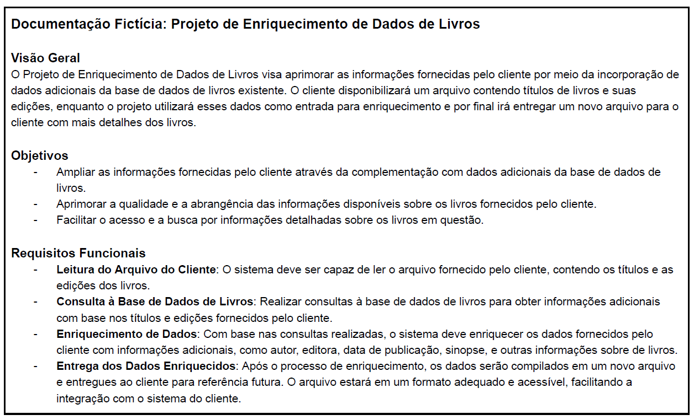
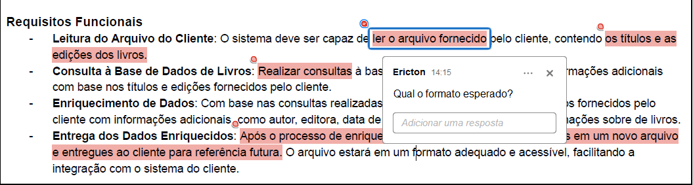
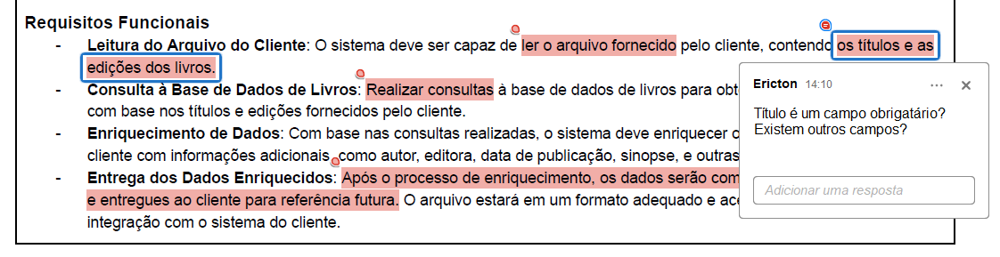
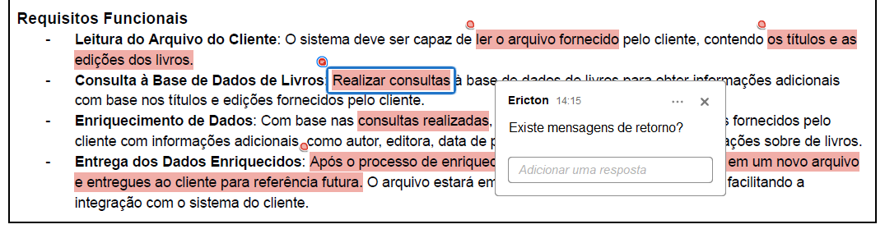
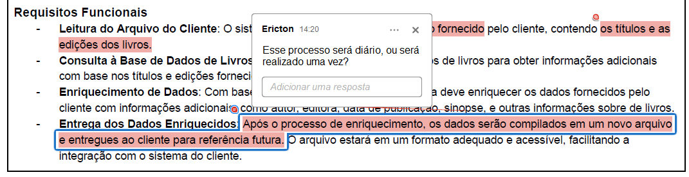
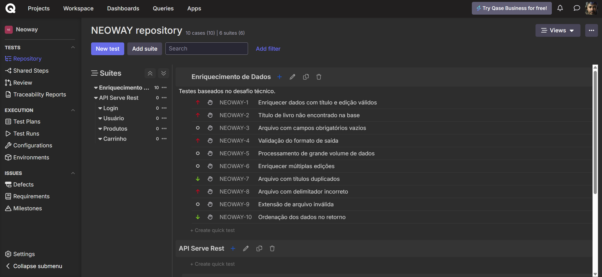

# Análise Crítica da Documentação

## 📌 Visão Geral do Projeto

A documentação fornecida descreve um projeto fictício de Enriquecimento de Dados de Livros, onde o cliente envia um arquivo contendo títulos e edições, e o sistema retorna esse conteúdo enriquecido com dados como autor, editora e sinopse. Embora a proposta seja clara em termos gerais, diversos pontos importantes não estão especificados, o que pode comprometer a entrega final e a experiência do cliente.

---

## 🔍 Pontos de Atenção e Ambiguidades

### 1. **Formato dos arquivos (entrada e saída)**

- Não há clareza sobre qual é o formato esperado dos arquivos enviados pelo cliente e qual será o formato retornado.
- Não está especificado se o arquivo deve ter cabeçalho, separador padrão (vírgula, ponto e vírgula) ou codificação (UTF-8, por exemplo).

### 2. **Campos obrigatórios e validados**

- A documentação cita apenas "título" e "edição" como campos, mas não define se são obrigatórios.
- Não é informado o comportamento do sistema se campos vierem vazios ou com dados inválidos.

### 3. **Tratamento de erros**

- Não há definição sobre o que acontece se um título de livro não for encontrado na base.
- Não está claro se há mensagens de retorno ao cliente informando erros ou se os erros serão ignorados.

### 4. **Periodicidade**

- Não foi mencionado se o processo será único, diário, semanal, ou disparado sob demanda.

### 5. **Volume de dados**
- Não há qualquer estimativa ou limitação mencionada sobre o volume de dados a ser tratado.

### 6. **Requisitos não funcionais**
- Nenhuma informação sobre tempo de resposta esperado, desempenho ou tolerância a falhas.

---

## 🧩 Conclusão

A documentação, embora apresente uma ideia geral, possui lacunas importantes que devem ser esclarecidas com o time de negócio antes do início do desenvolvimento. A ausência desses detalhes pode causar retrabalho, insatisfação do cliente e falhas no sistema.

## ➡️ Veja também as [Sugestões de Melhorias](sugestoes-melhorias.md) com base nesta análise.

## 📋 Veja os [Cenários de Teste - Gherkin](cenarios-enriquecimento.feature).

Para facilitar o acompanhamento e a análise dos cenários de teste, criei um projeto público no Qase — uma ferramenta voltada para o gerenciamento de testes manuais.
Além disso, disponibilizei na pasta files um arquivo em PDF contendo todos os testes registrados na plataforma, permitindo uma visualização completa mesmo fora do ambiente online.

Contudo, para acessá-lo, será necessário possuir um usuário cadastrado na plataforma, pois mesmo projetos públicos exigem login para visualização.

🔗 **Acesse os testes organizados no Qase:**  
[Visualizar casos de teste no Qase](https://app.qase.io/project/NEOWAY)

